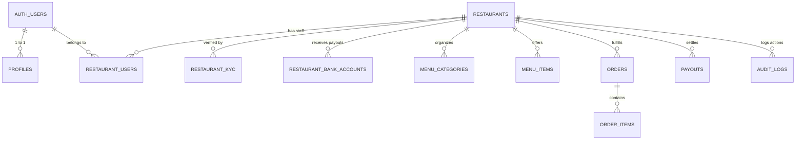
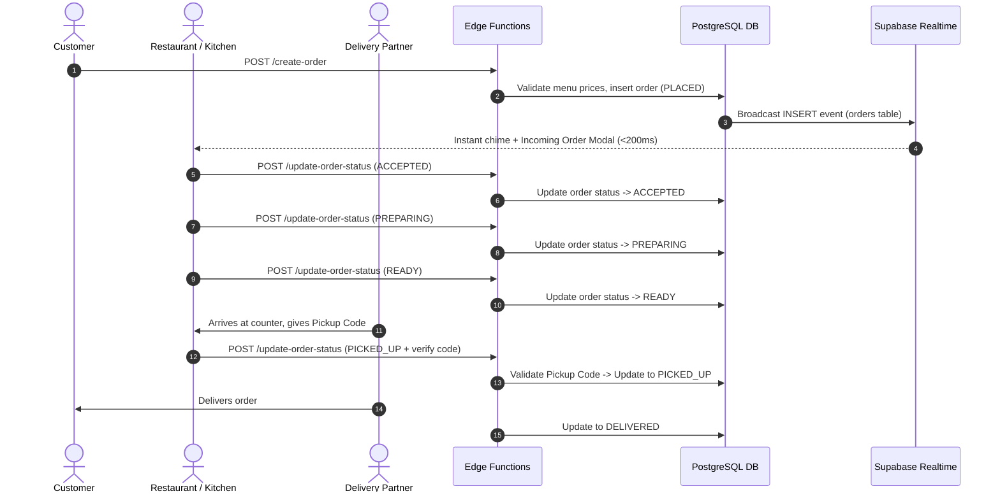

# FEEDO Restaurant Partner — System Architecture

## 1. High-Level Architecture Overview

```mermaid
flowchart TB
    subgraph ClientLayer [Client & Partner UI Layer]
        WebApp[Web Partner Dashboard (Vite / React)]
        MobileApp[Mobile Partner App (Capacitor Android)]
    end

    subgraph EdgeLayer [Edge Gateway & Edge Functions]
        CF[Cloudflare CDN / WAF]
        EF1[create-restaurant]
        EF2[submit-kyc]
        EF3[update-bank-account]
        EF4[update-order-status]
        EF5[process-payment-webhook]
        EF6[create-payout]
        EF7[audit-log]
    end

    subgraph SecurityLayer [Security & Access Control]
        Auth[Supabase Auth (JWT)]
        RBAC[Restaurant RBAC (restaurant_users)]
        RLS[PostgreSQL Row-Level Security Engine]
    end

    subgraph PersistenceLayer [Supabase Managed PostgreSQL 16]
        DB[(Tables: restaurants, orders, menu, kyc, bank, payouts, audit)]
        Storage[(Storage Buckets: kyc, docs, menu-images)]
        Realtime[(Realtime WebSocket Publisher)]
    end

    ClientLayer -->|HTTPS / TLS 1.3| CF
    CF --> EdgeLayer
    EdgeLayer --> SecurityLayer
    ClientLayer -.->|Direct Supabase Client via RLS| SecurityLayer
    SecurityLayer --> DB
    SecurityLayer --> Storage
    DB --> Realtime
    Realtime -.->|Push Notifications < 200ms| ClientLayer
```

---

## 2. Multi-Tenant Identity Model

The Feedo platform supports multiple restaurants per owner and multiple staff members per restaurant with specific roles:



---

## 3. Realtime Order Lifecycle Flow



---

## 4. Free-Tier to Enterprise Scaling Roadmap

| Tier | Component | Free Tier Implementation | Enterprise Scale Upgrade (No Code Rewrite) |
| :--- | :--- | :--- | :--- |
| **Database** | PostgreSQL | Supabase Free Tier (500MB DB, 2 Core CPU) | Supabase Pro / AWS Aurora PostgreSQL / GCP Cloud SQL |
| **Compute** | Serverless | Supabase Edge Functions (Deno Deploy) | Dedicated Kubernetes microservices / AWS ECS |
| **Storage** | Object Storage | Supabase Storage (1GB free) | Amazon S3 / Google Cloud Storage |
| **Realtime** | WebSocket Broker | Supabase Realtime (200 concurrent connections) | Supabase Realtime Pro / Redis PubSub Cluster |
| **Edge & CDN** | DNS & WAF | Cloudflare Free Tier (DDoS protection, TLS 1.3) | Cloudflare Enterprise (Custom WAF rules, Bot Management) |
